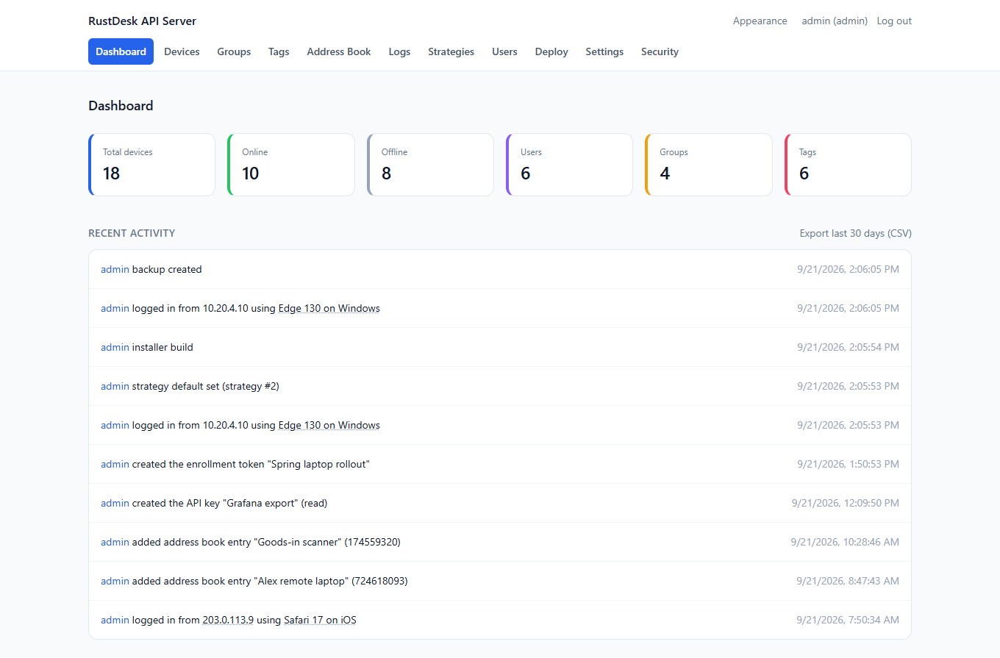

# RustDesk API Server

[](https://github.com/inteliboy/rustdesk-api-server/actions/workflows/ci.yml)
[](https://github.com/inteliboy/rustdesk-api-server/actions/workflows/docker.yml)
[](LICENSE)


A self-hosted **API server and management WebUI for [RustDesk](https://rustdesk.com)**, written in Python
(FastAPI + SQLite). Point your RustDesk clients at it and you get accounts, address books, a device
inventory with online/offline status, groups, tags, sharing, audit logs and remote client management, all
from one small server that runs the same on Windows, Linux, macOS and Docker.

It is an **API / control-plane layer**. It does not replace RustDesk's own `hbbs` (ID/rendezvous) or `hbbr`
(relay) servers, which you keep running alongside it.

```text
RustDesk Client
       |
       +----------------------+
       |                      |
       v                      v
   API Server (this)        hbbs
       |                      |
       |                      v
       |                    hbbr
       |
       v
   WebUI / Management
```

<p align="center">
  <picture>
    <source media="(prefers-color-scheme: dark)" srcset="screenshots/dashboard-dark.png">
    
  </picture>
</p>
<p align="center"><sub>The dashboard, in the theme your GitHub is using. More in <a href="#screenshots">Screenshots</a>.</sub></p>

## Highlights

- **Devices**: automatic registration from client heartbeats, online/offline status, search, filters, sorting,
  saved views, bulk actions, per-device timeline, CSV/JSON export and import
- **People**: administrators and users, groups, tags, explicit per-device sharing (view / control),
  personal and shared **address books** in the client's newer per-item protocol
- **Control the clients**: see and **disconnect** incoming connections, push **strategies** (permission
  and behaviour settings) to devices or groups, enroll devices with `rustdesk --assign`
- **Security first**: Argon2id passwords, optional **two-factor** login (also in the RustDesk client) and
  **single sign-on** with OpenID Connect, account lockout, revocable sessions and API keys, CSRF protection, strict Content-Security-Policy,
  IDOR-safe authorization on every endpoint, protection against device take-over by ID guessing
- **Operations**: SQLite with Alembic migrations, scheduled and pre-upgrade **backups**, **notifications**
  (webhook, ntfy, e-mail), log retention, server CPU/memory charts, Prometheus `/metrics`, `/health` and `/ready`,
  optional network allow-list for the WebUI
- **Self-contained WebUI**: light/dark themes, accent colours, no third-party requests, no Node.js at runtime,
  in English, Polish, French, German and Spanish

See [Features](#features) for the complete list.

## Screenshots

All screenshots are in the [`screenshots/`](screenshots/) folder. The WebUI has light and dark themes (choose
**Appearance** in the top bar, or leave it on "system"), so the main pages are shown in both. Everything on
them is fictional demo data: made-up people, devices and addresses, and made-up hardware in the server panel.

| Page | Light | Dark |
| ---- | ----- | ---- |
| Dashboard: counts, recent activity | [dashboard-light.png](screenshots/dashboard-light.png) | [dashboard-dark.png](screenshots/dashboard-dark.png) |
| Dashboard: server panel (CPU and memory charts, version, commit) | [dashboard-server-light.png](screenshots/dashboard-server-light.png) | [dashboard-server-dark.png](screenshots/dashboard-server-dark.png) |
| Devices: status, owner, group, tags | [devices-light.png](screenshots/devices-light.png) | [devices-dark.png](screenshots/devices-dark.png) |
| A device: details, strategy, sharing | [device-detail-light.png](screenshots/device-detail-light.png) | [device-detail-dark.png](screenshots/device-detail-dark.png) |
| Connection logs reported by the clients | [logs-light.png](screenshots/logs-light.png) | [logs-dark.png](screenshots/logs-dark.png) |
| Address book | [address-book-light.png](screenshots/address-book-light.png) | |
| Users (administrators) | [users-light.png](screenshots/users-light.png) | |
| Security: password, sessions, API keys | [security-light.png](screenshots/security-light.png) | |

## Quick start

### Docker

```bash
git clone https://github.com/inteliboy/rustdesk-api-server.git
cd rustdesk-api-server

# one-time: a secret for signing sessions, kept in .env (never commit it)
python3 -c "import secrets; print('SECRET_KEY=' + secrets.token_urlsafe(48))" > .env

docker compose up -d
```

On Windows PowerShell, create `.env` with
`"SECRET_KEY=$(python -c "import secrets; print(secrets.token_urlsafe(48))")" | Set-Content -Encoding ascii .env`.

Open <http://127.0.0.1:21114>, create the administrator on the setup screen, and you are in. The database
lives in a Docker volume and survives `docker compose down` / `up`.

**Prebuilt image.** Every push to `main` publishes a multi-architecture image (amd64, arm64) to the GitHub
Container Registry, so you can skip the clone and the build:

```bash
docker run -d --name rustdesk-api --restart unless-stopped \
  -p 21114:21114 -v rustdesk-data:/app/data \
  -e SECRET_KEY="paste-a-long-random-string" \
  -e EXTERNAL_URL="http://your-server:21114" \
  ghcr.io/inteliboy/rustdesk-api-server:latest
```

Details, upgrades, backups and running the CLI inside the container are under
[Docker](#docker-installation).

### Windows

```powershell
git clone https://github.com/inteliboy/rustdesk-api-server.git
cd rustdesk-api-server

python -m venv .venv
.venv\Scripts\Activate.ps1
pip install -e ".[dev]"

python -m rustdesk_api
```

### Linux and macOS

```bash
git clone https://github.com/inteliboy/rustdesk-api-server.git
cd rustdesk-api-server

python3 -m venv .venv
source .venv/bin/activate
pip install -e ".[dev]"

python -m rustdesk_api
```

Then open <http://127.0.0.1:21114>. Use `pip install .` instead if you only want to run it and do not need
the development tools.

### Connect a RustDesk client

In the RustDesk client's network settings set **ID server**, **Relay server** and **Key** to your `hbbs` /
`hbbr`, and **API server** to `http://your-server:21114` (the `http://` is required). Sign in with an account
created in the WebUI, and the client's address book, devices and logs start flowing. More in
[RustDesk client configuration](#rustdesk-client-configuration).

## Compatibility with RustDesk clients

Compatibility with real clients matters more here than a tidy API, so the state is tracked openly in
[`docs/rustdesk-compatibility.md`](docs/rustdesk-compatibility.md), including exactly what was and was not
tested. In short:

- **Tested against a real client (RustDesk 1.4.9, Windows):** login, heartbeat, system info, current user,
  and the legacy address book.
- **Implemented from the client's source, not yet exercised live:** the newer per-item address book, audit
  logs (`/api/audit/*`), connection notes, disconnect and strategies (including the server options that move
  clients to other servers), `--assign`, the two-factor login dialog and the OpenID Connect "Continue with ..."
  sign-in (also tested only against an in-process fake provider).
- **Tried briefly:** one Android device (sign-in, heartbeat and system info work; see
  [Android clients](#android-clients)).
- **Not tested:** other client versions and platforms (macOS, Linux, iOS, web client).

Treat it as a young project: run it against a test client first, and please report what you find.

## Contents

[Screenshots](#screenshots) · [Features](#features) · [Requirements](#requirements) · [Installation](#windows-installation) ·
[Docker](#docker-installation) · [Configuration](#configuration) · [Managing clients](#managing-clients) ·
[Two-factor authentication](#two-factor-authentication) · [Single sign-on](#single-sign-on-openid-connect) ·
[Accounts and access](#accounts-and-access) ·
[Working with many devices](#working-with-many-devices) · [Device identity](#device-identity) ·
[Monitoring](#monitoring-and-network-access) · [Log retention](#log-retention) ·
[Notifications](#notifications) · [Database backups](#database-backups) ·
[Connecting clients](#connecting-many-clients) · [Default strategy](#default-strategy-and-fleet-hygiene) ·
[Languages](#languages) · [Database](#database) ·
[First-run setup](#first-run-setup) · [Client configuration](#rustdesk-client-configuration) ·
[Older API servers](#moving-clients-from-an-older-api-server) · [Reverse proxy](#reverse-proxy-setup) · [Security](#security-recommendations) ·
[Backup and restore](#backup--restore) · [API docs](#api-documentation) · [Development](#development) ·
[Testing](#testing) · [Troubleshooting](#troubleshooting) · [Contributing](#contributing) ·
[License](#license)

## Status

Version 0.1.0. Phases 1 and 2 of the plan are done (application bootstrap, authentication, the
RustDesk-compatible API, device registration and heartbeat, groups, tags, sharing, admin UI, audit logs),
plus the account, fleet-management and hardening work described below, and OpenID Connect single sign-on from
Phase 3. LDAP sign-in and webhook notifications are not implemented.

## Features

- Python backend (FastAPI), SQLite by default
- RustDesk-compatible API endpoints (`/api/login`, `/api/heartbeat`, `/api/sysinfo`, ...)
- Project management REST API (`/api/v1/...`) with an OpenAPI spec
- Argon2id password hashing, revocable/expirable session tokens, CSRF protection for
  cookie-authenticated WebUI requests
- Device registration, heartbeat-based online/offline detection, search, pagination
- Device groups (owned per-user) and a global tag vocabulary, both usable as device filters
- Explicit device sharing (view/control permissions, optional expiry) - IDOR-safe, never
  implicitly grants delete or reassignment rights
- User management with administrator/user roles
- Server status on the administrator's dashboard: CPU and memory of the API server process and of the
  machine as live charts, plus the hardware (processor, RAM, disk) and software (OS, Python,
  library and SQLite versions, database size) it runs on - see Server status below
- Control of the RustDesk clients themselves: see who is connected to a machine and **disconnect** them,
  push **client strategies** (permission and behaviour settings) to devices or whole groups, and
  place devices with `rustdesk --assign` - see Managing clients below
- Optional **two-factor authentication** (authenticator-app codes plus recovery codes) for the WebUI and
  for the RustDesk client's own login - see Two-factor authentication below
- Optional **single sign-on with OpenID Connect** (Keycloak, Authentik, Google, Microsoft Entra, Okta, ...) in
  the WebUI and behind the RustDesk client's "Continue with ..." button - see Single sign-on below
- Account self-service and hardening: optional **self-registration** (with admin approval),
  administrator-issued **password-reset links**, **account lockout**, a list of your signed-in
  **sessions**, and personal **API keys** for scripts - see Accounts and access below
- Working with a fleet: **bulk actions** on the device list, filters (status, group, tag) with sorting,
  **saved views**, a per-device **timeline**, and CSV/JSON **export and import** - see Working with many
  devices below
- Device identity protection: a stranger who guesses a RustDesk ID cannot take the device over with an
  anonymous upload; a different install has to be approved by the owner - see Device identity below
- Optional restriction of the WebUI and management API to your own networks
  (`WEBUI_ALLOWED_NETWORKS`) and a token-protected Prometheus **`/metrics`** endpoint - see Monitoring
  and network access below
- Audit logging of administrative actions, with who/what shown in the dashboard's recent activity
- Log retention: activity, connection, file-transfer and alarm logs older than a configurable
  age are deleted automatically (defaults 365 / 180 days, `0` keeps forever), and
  expired login sessions are cleaned up - see Log retention below
- Connection, file-transfer and security-alarm logs reported by RustDesk clients
  (`/api/audit/conn`, `/api/audit/file`, `/api/audit/alarm`), visible per device owner/share - requires the *controlled* client's
  `API Server` to point at this server. File transfers show direction and From -> To (the
  client reports only the path on the controlled device). Only administrators can delete
  entries (one, all, or one device's); each deletion is itself audit-logged
- **Connection notes**: a user who turns on **Ask for note at end of connection** in the RustDesk client
  (Settings, off by default, needs the client signed in to this server) is asked for a note when a session ends;
  it is shown with that connection under Logs and on the device's timeline
- Address books for the RustDesk client: a personal book per user plus **shared books** you can
  share with other users (read-only, read/write or full control), managed from the WebUI or by
  the client itself. Speaks the client's newer per-item address-book protocol (no more
  whole-list overwrites and no "Legacy address book" label), with the legacy protocol kept as
  a fallback - see `ADDRESS_BOOK_LEGACY_MODE` and `docs/rustdesk-compatibility.md`
- Hover a public IP address for WHOIS-style details (network, organization, country, range)
  via RDAP - see the privacy note under Security recommendations
- RustDesk IDs are links that start a connection in your installed client
  (`rustdesk://connect/<id>`); usernames link to the user's details (administrators)
- Server-rendered WebUI (dashboard, devices, groups, tags, users) with light/dark/system themes
  and a selectable accent color (blue by default), chosen per browser under **Appearance**
- Fully self-contained WebUI: the stylesheet is compiled ahead of time and served locally, so
  pages load nothing from third-party origins and work on an isolated network
- Strict Content-Security-Policy (`script-src 'self'`): the WebUI runs no inline script, so an
  HTML injection cannot execute JavaScript
- **Notifications** to a webhook, ntfy or e-mail (offline devices, new devices, take-over attempts, client alarms,
  locked accounts, failed backups), **scheduled and pre-upgrade database backups**, a **default strategy** for new
  devices, **archiving** of devices that are gone and a flag for **outdated clients** - see Notifications, Database
  backups and Default strategy and fleet hygiene below
- A **Connect** page with the client's config string, a QR code and setup commands - see Connecting many clients
- WebUI in English, Polish, French, German and Spanish - see Languages below
- Runs natively on Windows/Linux/macOS, or via Docker
- Alembic database migrations

## Requirements

- Python 3.10+
- No Linux-specific dependencies; development happens primarily on Windows

## Windows installation

Follow the [Windows quick start](#windows). The database is created on first start (`data/rustdesk.db`
relative to where you run it, unless `DATABASE_URL` says otherwise) and migrations run automatically.

To upgrade: `git pull`, then `pip install -e ".[dev]"` again and restart. Take a
`rustdesk-api backup` first - a new version may migrate the database.

## Linux installation

Follow the [Linux and macOS quick start](#linux-and-macos). Nothing needs systemd, but a unit file that runs
`python -m rustdesk_api` from the virtual environment is a natural way to keep it running. Upgrade as on
Windows.

## macOS installation

Same as Linux, using the system or Homebrew Python 3.10+.

## Docker installation

```bash
docker compose up -d
```

`docker-compose.yml` builds the image from this repository and needs a `SECRET_KEY` (in your environment or a
`.env` file next to it - see the [quick start](#docker)). Open <http://127.0.0.1:21114>.

- **Data.** The SQLite database is in the named volume `rustdesk-data` (mounted at `/app/data`), so it
  survives `docker compose down` and `up`; `docker compose down -v` deletes it. A named volume is used because
  the container runs as a non-root user (uid 10001) and a bind-mounted `./data` that Docker created as root
  would not be writable on Linux. To use a folder instead, change the volume to `./data:/app/data` and run
  `mkdir -p data && sudo chown 10001:10001 data` first (Docker Desktop on Windows and macOS needs no `chown`).
- **Settings.** Every variable in `.env.example` can be set on the container (`docker run -e NAME=value`). With
  Compose, only the variables `docker-compose.yml` lists are read from your environment or the `.env` file
  (`SECRET_KEY`, `DATA_ENCRYPTION_KEY`, `EXTERNAL_URL`, `SECURE_COOKIES` and the `OIDC_*` ones); add any other,
  such as `TRUSTED_PROXIES`, under `environment:` in that file. Set `EXTERNAL_URL` to the address people type into
  the browser (password reset and sign-in links use it), and `SECURE_COOKIES=true` once it is served over HTTPS.
- **Prebuilt image.** `ghcr.io/inteliboy/rustdesk-api-server`, for amd64 and arm64, tagged `latest`,
  a short commit hash (`sha-1a2b3c4`) and, for releases, the version (`0.1.0`). Use it instead of `build: .`
  by putting `image:` in the compose file. If the repository is private the package is private too: run
  `docker login ghcr.io` with a token that has the `read:packages` scope first.
- **Management commands.** The image's entrypoint is the `rustdesk-api` CLI, so:

  ```bash
  docker compose run --rm rustdesk-api generate-key       # a key for DATA_ENCRYPTION_KEY
  docker compose exec rustdesk-api rustdesk-api create-admin
  docker compose exec rustdesk-api rustdesk-api backup
  docker compose exec rustdesk-api rustdesk-api list-users
  ```

- **Backups.** `rustdesk-api backup` writes a consistent snapshot to `/app/data/backups/` inside the volume.
  Copy it out with `docker compose cp rustdesk-api:/app/data/backups ./backups`. See
  [Backup / restore](#backup--restore).
- **Upgrading.** From source: `git pull && docker compose up -d --build`. Prebuilt image:
  `docker pull ghcr.io/inteliboy/rustdesk-api-server:latest`, then recreate the container. Back up first;
  migrations run when the new container starts.
- **Behind a reverse proxy.** Publish the port only to the proxy, set `TRUSTED_PROXIES` to its address and
  `EXTERNAL_URL` to the public URL. See [Reverse proxy setup](#reverse-proxy-setup).
- **A shell in the container.** The container's main process only writes its log, and it has no terminal
  attached, so the first "Terminal" view in Synology's Container Manager (or `docker attach`) shows log output
  and takes no input. Open a new session instead: in Container Manager choose **Terminal -> Create** and run
  `sh`, or use `docker exec -it rustdesk-api sh`.
- The container has a health check on `/health`, stops cleanly on `SIGTERM` (`docker stop`), and needs no shell.

### How the Docker image is tested

The [Docker workflow](.github/workflows/docker.yml) builds the image on every push and pull request and
checks, against the running container: `/health` and `/ready`, the WebUI and its stylesheet, first-run setup,
a RustDesk-style login, device registration and heartbeat, that it runs as non-root, that the data is still
there after `docker restart` and after `docker compose down` / `up`, that it exits cleanly on `SIGTERM`, and
that neither the secret key nor a password appears in its log. Pushes to `main` and version tags then publish
the image. It does the same as this, which you can run yourself against any disposable container
(`first` on a fresh one, restart it, then `again`):

```bash
python scripts/docker_smoke.py first --url http://127.0.0.1:21114
python scripts/docker_smoke.py again --url http://127.0.0.1:21114
```

That is an automated check, not the same as running it for weeks with real clients: the image has not yet
been exercised that way.

## Configuration

Configuration is via environment variables (or a `.env` file). Copy `.env.example` to `.env`
and adjust as needed:

```powershell
Copy-Item .env.example .env
```

See `.env.example` for the full list of variables (host/port, database URL, secret key,
registration policy, device online timeout, CORS, trusted proxies, RustDesk infrastructure
addresses, session lifetime, rate limiting, log retention, cookie security).

The settings added by client management are `ALLOW_SYSINFO_PRESETS` (see Managing clients) and, for
two-factor authentication and saved address-book passwords, `DATA_ENCRYPTION_KEY`. Accounts and access add
`ALLOW_REGISTRATION`, `REGISTRATION_REQUIRES_APPROVAL`, `PASSWORD_RESET_LIFETIME_MINUTES`,
`LOGIN_LOCKOUT_THRESHOLD`, `LOGIN_LOCKOUT_MINUTES`, `WEBUI_ALLOWED_NETWORKS` and `METRICS_TOKEN`;
device identity adds `DEVICE_UUID_REBIND`. Each is described in `.env.example`; the `OIDC_*` settings are
explained under [Single sign-on](#single-sign-on-openid-connect). The `NOTIFY_*`, `BACKUP_*`,
`DEVICE_STALE_DAYS` and `MIN_CLIENT_VERSION` settings are explained under [Notifications](#notifications),
[Database backups](#database-backups) and [Default strategy and fleet hygiene](#default-strategy-and-fleet-hygiene).

The Dashboard shows which build is running: the version, the git commit (linked to GitHub) and the RustDesk
client release whose source the protocol code was written against. The Docker images get the commit from CI and
keep it in a file inside the image, so a container that was recreated from saved settings (as Synology's Container
Manager does) still reports the commit of the image it runs, not an old one; from a git checkout it is read from
`git`; otherwise it shows as unknown. `GIT_COMMIT` sets it outside a Docker image, or for your own image built with
`--build-arg GIT_COMMIT=$(git rev-parse HEAD)`. `GET /api/version` returns the same facts.

Generate a real `SECRET_KEY` with:

```powershell
python -c "import secrets; print(secrets.token_urlsafe(48))"
```

## Managing clients

The RustDesk client checks in with this server every few seconds (its *heartbeat*), and the answer can carry
instructions. Three things use that:

**Active connections and disconnect.** A device's page lists the incoming connections the client last reported,
with who is connecting (from the client's own connection log, when it has reported them). The device's owner or
an administrator can **Disconnect** one or all of them. The request reaches the client with its next heartbeat -
a few seconds while a connection is open - so it is not instant. A share with "control" permission can edit the
device but cannot end connections.

**Strategies** (administrators, **Strategies** page). A strategy is a named set of client settings - which
permissions incoming sessions get (keyboard, clipboard, file transfer, ...), how connections are approved, a few
client behaviours. Assign it to a device (its page) or to a group (the Groups page); a device's own strategy wins
over its group's. The client applies it with its next heartbeat. Settings a strategy leaves unset are reset to
the client's default, so removing a setting, or unassigning the strategy, takes effect too. Only the switches
listed on the Strategies page can be pushed - never passwords, IP whitelists or proxy settings. They
are the options the client keeps in its own `Config` store; settings it reads from its local or per-session
config (for example update checks or outgoing-session recording) cannot be reached this way and are not offered.

The **Servers** section (API server, ID server, relay server, key, WebSocket) moves clients to other servers, for
example after a host name change. Those settings are validated strictly (the API server must be a plain `https://`
address, not port 21114, which the client removes) and are *sticky*: they are pushed only while set, and removing
them later leaves clients as they are, because resetting them would erase the addresses and key a client was
installed with. **Try it on one device first** - assign the strategy to that device alone - because a client
that can no longer reach this server cannot be corrected from here. The key must match the ID server's public key.
A worked example is under [Moving clients from an older API server](#moving-clients-from-an-older-api-server).

The **Connection** column on the Devices page (and *API connection* on a device's page) shows whether the
device's last heartbeat came in over **HTTPS** or plain **HTTP** - handy while moving clients off an old
`http://...:21114` address. Behind a reverse proxy it needs the proxy in `TRUSTED_PROXIES` and an
`X-Forwarded-Proto` header (most proxies set it), otherwise every device looks like plain HTTP. If a device's
strategy sets an `https://` API server and its heartbeat arrives over plain HTTP, the client has evidently dropped
that setting (say it was removed by hand), so the strategy is sent again, at most every 5 minutes. That only
works while the client can still reach this server at all; the ID server, relay server and key cannot be checked
this way and are not re-sent.

**`rustdesk --assign`.** Run on a device as administrator/root,
`rustdesk --assign --token <token> --user_name alice --address_book_name "My address book" --address_book_tag office`
puts that device in a user's address book (with tag, alias, note), device group, and - for administrators -
gives it an owner or a strategy (`--strategy_name`). Also `--note` and `--device_name` (sets the alias).
Create the token on the **Security** page (*Enrollment tokens*): it can do this and nothing else, is shown once,
expires (30 days to a year) and can be revoked. A regular login token works as well. A user can only touch
devices that are unowned or theirs and only their own books and groups; anything else needs an administrator.
`--address_book_password` needs a *shared* address book and `DATA_ENCRYPTION_KEY`.

Clients built with `preset-*` options send those in their system-info upload, which carries no credentials.
Honouring them is **off** (`ALLOW_SYSINFO_PRESETS=false`): turning it on lets anyone who can reach this server
place a *new* device in a named user's address book, group or strategy. Only a device's first registration is
ever affected, and each use is audit-logged.

## Two-factor authentication

Turn it on under **Security**: scan the QR code with an authenticator app (any TOTP app; or type the key shown
under it), confirm with a code, and save the ten recovery codes, which are shown once. From then on signing in to the WebUI asks for a code, and so
does the RustDesk client (it shows its own verification-code dialog). Turning it off or making new recovery
codes needs your password and a current code.

- It needs `DATA_ENCRYPTION_KEY`: the secret has to be readable to check codes, so it is stored encrypted with
  that key (`rustdesk-api rotate-data-key` re-encrypts it too). Without the key the Security page says so.
- If the key is later lost, accounts with 2FA **cannot sign in** rather than skipping the second factor; recovery
  codes still work in the WebUI, and an administrator can turn it off for a user (Users page, *Reset 2FA*) or run
  `rustdesk-api disable-2fa --username alice`. Either signs that user out everywhere.
- Codes are accepted a step either side of now and never twice; a sign-in attempt dies after five wrong codes.
  The RustDesk client can only type six digits, so recovery codes are for the WebUI.

## Single sign-on (OpenID Connect)

Let people sign in with your identity provider (Keycloak, Authentik, Google, Microsoft Entra, Okta, ...) in the
WebUI and in the RustDesk client, whose login window then shows a **Continue with ...** button. It is off until
you set both `OIDC_ISSUER` and `OIDC_CLIENT_ID`.

1. At the provider, create a **web / confidential** application (a public client with PKCE also works: leave
   `OIDC_CLIENT_SECRET` empty) and register this redirect URI exactly: `EXTERNAL_URL` + `/api/oidc/callback`, for
   example `https://rustdesk.example.com/api/oidc/callback`. It has to be `https`, except for `localhost`.
2. Set `EXTERNAL_URL` to the address users open, a real `SECRET_KEY` (the sign-in's PKCE verifier and nonce are
   derived from it), and:

   ```env
   OIDC_ISSUER=https://keycloak.example.com/realms/main
   OIDC_CLIENT_ID=rustdesk
   OIDC_CLIENT_SECRET=...
   OIDC_NAME=keycloak
   ```

   The issuer is the address whose `/.well-known/openid-configuration` describes the provider: Keycloak
   `https://HOST/realms/REALM`, Authentik `https://HOST/application/o/SLUG/`, Google `https://accounts.google.com`,
   Microsoft Entra `https://login.microsoftonline.com/TENANT-ID/v2.0` (a single tenant; the multi-tenant `common`
   issuer is not supported). `OIDC_NAME` is the button label; `google`, `github`, `gitlab` and `azure` also get the
   client's own icon. The provider has to put `email` (and `email_verified`) in the ID token: this server never
   calls the user-info endpoint.
3. **Who a provider account is.** Nothing is guessed:
   - A user **links** their account under **Security > Single sign-on** (they sign in as usual, go to the
     provider and come back). From then on the provider account, identified by its issuer and subject and not by
     its e-mail address, signs in as that user.
   - `OIDC_LINK_BY_EMAIL=true` also links, on first sign-in, the local user with the same **verified** e-mail
     address. Leave it off unless you trust the provider: anyone who controls that address there would get that
     account.
   - `OIDC_AUTO_CREATE_USERS=true` creates a plain (never administrator) user for a verified address, and needs
     `OIDC_ALLOWED_EMAIL_DOMAINS` (`example.com,example.org`), which also limits e-mail linking. Such a user has no
     password until an administrator sends a reset link, and cannot unlink their last way in.
   - Otherwise the sign-in is refused and nothing is created. A disabled user cannot sign in either way.
4. In the RustDesk client, sign in as usual under **Settings > Account**; **Continue with ...** opens the
   provider in the browser and the client signs in when you finish there.

Good to know: the provider does the authentication, including any multi-factor step, so a linked account does not
also get the local two-factor prompt. Every sign-in and link is in the audit log (`via` shows `webui_oidc` or
`rustdesk_client_oidc`; failures carry a short reason, never a token). The flow is the authorization code with
PKCE, `state` and `nonce`; ID tokens are checked (signature against the provider's keys with asymmetric
algorithms only, issuer, audience, expiry, nonce) and every provider URL must be https. Not yet tried against a
real provider or a real RustDesk client: see `docs/rustdesk-compatibility.md`.

## Accounts and access

**Self-registration.** With `ALLOW_REGISTRATION=true` the sign-in page offers *Create an account*
(`/register`). The account is never an administrator, and with the default
`REGISTRATION_REQUIRES_APPROVAL=true` it cannot sign in until an administrator enables it on the Users page
(the activity feed shows who registered). Registration is refused until the first administrator exists (use
`/setup`), and shares the sign-in rate limit. Turning approval off lets anyone who can reach the server create a
working account: only do that on a private network.

**Forgotten passwords.** Nothing is emailed. On the Users page an administrator chooses *Reset link* for the
user and hands the link over (a chat message, in person). The link works once, expires after
`PASSWORD_RESET_LIFETIME_MINUTES` (60 by default), voids any older link for that user, and its secret sits after
the `#` so it never reaches server logs. Setting the password through it signs the user out everywhere and lifts
a lockout; two-factor stays on. The link is built from `EXTERNAL_URL`, so set that to the address users open.
`rustdesk-api reset-password` and the Users page's direct reset still exist.

**Lockout.** `LOGIN_LOCKOUT_THRESHOLD` (10) wrong passwords in a row lock the account for
`LOGIN_LOCKOUT_MINUTES` (15); while it is locked even the right password is refused, or the lock would not stop
guessing. Wrong two-factor codes count too, on both sign-in paths (WebUI and RustDesk client). The first wrong
guess after a lock lapses locks it again. An administrator unlocks on the Users page (a *Locked* badge shows) or
with `rustdesk-api unlock-user --username alice`; a successful login resets the count. Be aware that anyone can
lock a username they know: the per-IP sign-in rate limit keeps that slow, and `0` turns lockout off.

**Changing your password.** **Security -> Password** takes your current password and a new one (8+ characters).
This session stays signed in; every other session, API key and enrollment token of yours ends, so a change
after a suspected leak also cuts off whoever had them. A wrong current password counts towards the lockout
below, like a wrong password at sign-in. It is not available to API keys.

**Sessions.** **Security -> Signed-in sessions** lists your browsers and RustDesk clients with address and
last use. Sign out one, or *everywhere else*.

**API keys.** **Security -> API keys** creates a bearer token for a script that calls this server's `/api/v1`
API (`curl -H "Authorization: Bearer <key>" http://server:21114/api/v1/devices`). A *read* key can only `GET`;
a *full* key acts as you, so treat it like a password (an administrator's full key can do anything an
administrator can). Keys expire (30 days to a year), can be revoked, and are shown once - only a hash is
stored. A key works only as an `Authorization` header on `/api/v1`, never as a cookie and never on the RustDesk
client endpoints, and it cannot manage the account itself (create keys, list sessions, change two-factor).
Keys stop working the moment their user is disabled.

## Working with many devices

- **Bulk actions.** Tick devices on the Devices page and apply *add/remove tag*, *move to group*, and - for
  administrators - *set owner* or *set strategy*, or *delete*. Every device is checked with the same rules as
  editing it alone, and the answer says which were skipped and why (a device you cannot see is reported as not
  found, so this never confirms that an id exists). Up to 200 per request; each change is audit-logged per device.
- **Filters and sorting.** By status (online/offline), group, tag and search text, sorted by last seen,
  registration date, name or ID. All of it happens on the server.
- **Saved views.** *Save these filters* names the current filters; pick it later from *Saved views*. They are
  per user.
- **Timeline.** A device's page shows what happened to it: it came back online (and how long it had been
  silent), connections to it, edits, shares, strategy changes, disconnect requests and takeover attempts. The
  owner and administrators also see who made each change; someone the device is only shared with does not.
  Timeline events age out with the audit log (`AUDIT_LOG_RETENTION_DAYS`).
- **Export.** *Export CSV/JSON* on the Devices page (the devices you may see), *Export CSV* on the Users page,
  and the last 30 days of the audit log on the Dashboard (administrators). Exports never contain password
  hashes, tokens or device identities, and cells that a spreadsheet would run as a formula are prefixed with a
  quote. Each export is itself audit-logged. The same data is at `/api/v1/export/devices|users|audit`.
- **Import** (administrators, Devices page). A CSV with a header row (or a JSON list) using any of
  `rustdesk_id` (required), `alias`, `name`, `note`, `owner` (username), `group` (an existing group's name),
  `tags` (`;`-separated, created if missing). Existing devices are updated, unknown IDs are created (they take
  their identity from the first real upload). An empty cell leaves the field alone. Every row is checked first;
  *Check only* reports what would happen, and if any row is bad nothing is imported. It moves management data, not
  device secrets, and it does not read other servers' database formats.

## Device identity

The client's `/api/sysinfo` and `/api/heartbeat` carry no credentials by protocol design, and a RustDesk ID is a
9-digit number. The `uuid` the client generates is therefore the only thing tying a heartbeat - and with it the
strategy pushed to the device and the disconnect requests - to a device record.

Without protection, anyone who knew an ID could upload system info with a new uuid and take over the record. So
with the default `DEVICE_UUID_REBIND=approve`:

- an upload for a known ID with a **different** uuid changes nothing; the new uuid is parked, the device gets a
  *Review* badge and a banner, the audit log records an attempt, and the device's owner or an administrator
  **accepts** it (you reinstalled or replaced the machine) or **rejects** it;
- heartbeats from an unknown uuid get no strategy or disconnect handling and no longer make the device look online;
- an upload or RustDesk-client login made **while signed in** as the device's owner (or an administrator) is
  trusted and re-binds at once, so signing in from a reinstalled client just works; a login by another user
  cannot take over an unowned or someone else's device;
- the API no longer returns a device's uuid to anyone.

`deny` ignores such uploads instead; `allow` restores the old behaviour. A brand-new ID always registers freely.
The residual risk is the first upload for an ID nobody has registered yet: whoever sends it first owns the
identity. Import or `rustdesk --assign` a device beforehand if that matters.

## Monitoring and network access

- **`/metrics`** (Prometheus text format) is off until `METRICS_TOKEN` is set (16+ characters); scrape it with
  `Authorization: Bearer <token>`. It reports device counts (online/offline/pending review), open connections,
  users (active, locked), active sessions by kind, sign-ins in the last 24 hours by result, and per-process
  heartbeat and system-info counters (these restart from zero and, with several worker processes, are per
  process). It contains counts only - no device data, names or secrets. Not part of the OpenAPI docs.
- **`WEBUI_ALLOWED_NETWORKS`** (comma-separated CIDRs/addresses) limits the WebUI pages, `/api/v1` (including the
  live-update WebSocket) and `/docs` to those networks; anything else gets `403`. The RustDesk client protocol,
  `/health`, `/ready` and `/metrics` are never restricted - clients and monitoring connect from anywhere. An
  address that cannot be determined is refused. Behind a reverse proxy list it in `TRUSTED_PROXIES`, or the
  proxy's own address is what gets checked. `rustdesk-api check-config` prints the effective rule. Mind that this
  can lock you out of the WebUI if the list is wrong; the CLI (`rustdesk-api ...`) still works.

## Server status

Administrators see a **Server** section at the bottom of the Dashboard:

- live cards and charts for CPU (the API server process and the whole machine, as a share of all
  cores) and memory (the process's resident memory, and system memory in use);
- what it runs on: processor, cores, clock, RAM, swap, free space on the disk holding the data,
  operating system, host name, whether it is inside a container, uptime;
- software: application, Python, SQLite and key library versions, database and write-ahead-log size.

Readings are taken every `SERVER_METRICS_INTERVAL_SECONDS` (10, allowed 5-300) and the last
`SERVER_METRICS_HISTORY_MINUTES` (60, allowed 5-360) are kept **in memory**: nothing is written to
the database, the charts start empty after a restart, and with several worker processes each one
reports its own. Inside a container the hardware shown is the host's. The endpoint behind it,
`GET /api/v1/admin/server`, is administrator-only and never returns environment variables,
the database URL or file paths. CPU and memory are read with [psutil](https://pypi.org/project/psutil/),
which has wheels for Windows, Linux and macOS.

## Log retention

Without a limit the activity log (logins, admin changes), the connection log, the
file-transfer log and the alarm log grow forever - and the last three are fed by unauthenticated
client endpoints.
A background task inside the server deletes what has aged out, once at startup and then every
`LOG_RETENTION_INTERVAL_HOURS` (24):

| Setting | Default | Applies to |
| --- | --- | --- |
| `AUDIT_LOG_RETENTION_DAYS` | `365` | the activity log shown as *Recent activity* |
| `CONNECTION_LOG_RETENTION_DAYS` | `180` | connection, file-transfer **and** alarm logs |
| `LOG_RETENTION_INTERVAL_HOURS` | `24` | how often the task runs |

`0` keeps that kind of log forever. **The defaults delete data**: after upgrading, anything older
than these limits is removed on the first start, so set the values you want (or `0`) before
starting a server whose history you care about, and take a `rustdesk-api backup` first if unsure.
Deletion happens in batches so it does not stall the server, and a run that deletes any log adds
one activity-log entry ("Retention policy removed ...") with the counts, so removal is itself
traceable. Expired or long-revoked login sessions are cleaned up on the same schedule
regardless of these settings.

To see or run it by hand:

```powershell
rustdesk-api purge-logs --dry-run   # report what would be deleted
rustdesk-api purge-logs             # delete it now
```

Several server processes running the task at once is harmless (every run is idempotent).

## Notifications

The server can tell you when something needs attention, through any of three channels. All of them are
set with environment variables (a webhook URL, an ntfy topic and an SMTP password are credentials, so they
never go into the database and the WebUI shows only the host name): `NOTIFY_WEBHOOK_URL` (a JSON `POST`;
`NOTIFY_WEBHOOK_SECRET` signs the body with HMAC-SHA256 in `X-RustDesk-API-Signature`, and the body also has
`text` and `content` fields so Slack, Mattermost and Discord accept it as it is), `NOTIFY_NTFY_URL` with an
optional `NOTIFY_NTFY_TOKEN` (phone notifications through [ntfy](https://ntfy.sh)), and `NOTIFY_SMTP_HOST`,
`NOTIFY_SMTP_PORT`, `NOTIFY_SMTP_USER`, `NOTIFY_SMTP_PASSWORD`, `NOTIFY_SMTP_SECURITY` (`starttls`, `ssl` or
`none`), `NOTIFY_EMAIL_FROM` and `NOTIFY_EMAIL_TO` (e-mail). Every channel that is set gets every enabled event.

`NOTIFY_EVENTS` chooses the events (default: all but `device_back_online`): `device_offline`,
`device_back_online`, `new_device`, `device_takeover_attempt`, `client_alarm`, `account_locked` and
`backup_failed`. A device is reported offline only if an administrator flagged it (**Notify me when this device
goes offline** on its page, or the bulk action on the device list, so a laptop that sleeps does not page
you), after `NOTIFY_OFFLINE_AFTER_MINUTES` (default 10) without a heartbeat, once per outage. The same alarm from
the same device, and the same locked account, are sent at most once every five minutes, and
`NOTIFY_MAX_PER_MINUTE` (default 20) caps the rest; the next message says how many were dropped.

Sending happens in a background thread, so a dead channel never slows a heartbeat or a login. A redirect from
the webhook or ntfy URL is not followed (it could carry a token to another host), and a failure is reported
without the URL or any credential. **Settings** in the WebUI shows which channels are set and sends a test
message; nothing here has been tried against a real Slack, ntfy or mail server, only against fakes in the tests.

## Database backups

The server backs up its SQLite database by itself, with the same `VACUUM INTO` snapshot as `rustdesk-api backup`:

- **Before a migration.** When a newer version finds the database behind (an upgrade that changes the schema) it
  first writes `rustdesk-premigrate-<time>.db` and only then migrates, so a bad upgrade can be undone. If the copy
  cannot be written the migration does not run (`BACKUP_BEFORE_MIGRATION=false` skips this). The newest five are kept.
- **On a schedule.** Every `BACKUP_INTERVAL_HOURS` (default 24; `0` turns it off) a `rustdesk-auto-<time>.db`, of
  which the newest `BACKUP_KEEP` (default 7) are kept. A restart does not add one; a failed one raises `backup_failed`.
- **By hand.** `rustdesk-api backup`, or **Back up now** under **Settings**; these are never deleted automatically.

They go to `BACKUP_DIR` (default: a `backups` folder next to the database, which in Docker is inside the data
volume). A backup is a full copy of the database with the password hashes in it: keep the folder as private as the
database. Restore by stopping the server, replacing `rustdesk.db` with the backup and starting it again.

## Connecting many clients

**Connect** in the WebUI (any signed-in user) shows what a RustDesk client needs to know about this server: the
ID server, relay, API server and the public key, as a **config string**, a **QR code**, a **file name** for a
renamed Windows executable and ready-to-run commands (`rustdesk --config ...`, optionally `--assign`). The fields
start from `RUSTDESK_ID_SERVER`, `RUSTDESK_RELAY_SERVER`, `RUSTDESK_KEY` and `EXTERNAL_URL` and can be edited on the
page. It warns about the two mistakes that silently break a client (`https://...:21114` and an API address with no
`http://`). No enrollment token is ever shown there; it is a placeholder, created on **Security**.

The formats come from the client's source (`ServerConfig` in `common.dart`, `custom_server.rs`): the string is
`{"host","relay","api","key"}` as URL-safe base64, reversed. `--config` needs the installed client and administrator
or root rights. This was checked against the source and the string's round trip in the tests, **not** by running a
client against the generated commands: try them on one machine first (the macOS one is the least certain).

## Default strategy and fleet hygiene

- **Default strategy.** Mark one strategy as the default (**Strategies**, *Make default*): every device that has no
  strategy of its own and none through its group receives it with its next heartbeat, so a new machine starts with your
  baseline instead of the client's defaults. A device's own strategy, then its group's, win over it. The dashboard
  counts the devices that would get no strategy at all.
- **Archived devices.** With `DEVICE_STALE_DAYS` set (default `0`, off) a device unseen for that long is archived:
  it leaves the default list and the counts, stays under the *Archived* status filter (and in search), and comes back
  by itself when it reports. Devices flagged for offline notifications are never archived. Devices can also be archived
  and restored by hand and in bulk.
- **Outdated clients.** With `MIN_CLIENT_VERSION` set (for example `1.4.0`) devices reporting an older client get an
  *Outdated* badge and are counted on the dashboard. A device that reports no readable version is not flagged.
- **New devices** in the last 24 hours, outdated clients, devices without a strategy and archived devices are listed
  on the dashboard with a link to where to act on them.

## Languages

The WebUI comes in English, Polish, French, German and Spanish. It starts in the first of those your browser asks for
and remembers a choice made with the language menu (a cookie, per browser, like the theme). English is the source
text; the other languages are catalogs (`frontend/i18n/*.txt`, one line per phrase) that `scripts/build_i18n.py`
turns into `static/i18n/<lang>.js`, and a small script (`static/js/i18n.js`) translates what is on the page, including
what the other scripts add later. Anything without a translation stays English, so a page may be partly translated:
the strategy option names and their help, server error messages and text a client or a person supplied are not (a
phrase someone types that is *exactly* a UI phrase would be translated too). Notifications and e-mails are English.
The translations were written for this project and have not been reviewed by native speakers; corrections are welcome
as pull requests to the catalog files. To add a phrase, add its line to a catalog file and run
`python scripts/build_i18n.py`; `pytest` fails if the generated files are out of date.

## Database

SQLite is the default and first-class database (`DATABASE_URL=sqlite:///./data/rustdesk.db`).
Schema changes are managed with Alembic migrations under
`src/rustdesk_api/db/migrations/`. Migrations are applied automatically on startup
(`python -m rustdesk_api` / `rustdesk-api serve`), and can also be applied explicitly:

```powershell
rustdesk-api migrate
```

## First-run setup

On first start, with no users in the database, the WebUI redirects to `/setup` to create the
first administrator account. After that account exists, `/setup` is permanently disabled
(`POST /api/v1/auth/setup` returns 403). Registration of additional accounts through the WebUI
is controlled by `ALLOW_REGISTRATION` (default `false`; see Accounts and access). Otherwise use
`rustdesk-api create-admin` or the Users admin screen.

## RustDesk client configuration

Point your RustDesk client's `--api-server` (or the equivalent client setting) at this server's
external URL, e.g. `http://your-server:21114`. Configure `RUSTDESK_ID_SERVER`,
`RUSTDESK_RELAY_SERVER` and `RUSTDESK_KEY` in your environment to match your `hbbs`/`hbbr`
deployment - this project does not run or replace those services.

**Do not use `https://...:21114` as the API server.** The client deletes `:21114` from any `https://` API
server address (`get_api_server` in the client's `src/common.rs`; only a build-time option disables this), so
`https://example.com:21114` is silently used as `https://example.com` - port 443, usually another web server,
and login fails with `FormatException ... <html>`. Plain `http://host:21114` is not affected. For HTTPS put the API
on another port (`https://example.com:21120`) or, better, on its own host name on 443
(`https://rustdesk.example.com`, reverse-proxied to this server), and enter that in the client. With the API
server field empty the client assumes `http://<id server>:21114`.

### Android clients

An Android device reports to the server only while the app's service is running (the Share Screen tab's **Start
service**). With the service stopped the app can still sign in, which registers the device with just its ID and
address, but it sends no heartbeat and no system info - so the device shows no host name, OS or version, and goes
offline once `DEVICE_ONLINE_TIMEOUT` passes. Start the service and the details appear within seconds. This is how
the client works, not a server setting, and a phone whose service is off cannot be connected to either.

**Address book mode.** The client decides between its newer address book (personal and shared
books, per-item changes) and the old "Legacy address book" by asking the server, and this
server answers for the newer one by default. If a client misbehaves with it, set
`ADDRESS_BOOK_LEGACY_MODE=true` to put every client back on the legacy book. Both modes use the
same personal book, so nothing is lost by switching.

**Saved passwords in shared address books.** A shared book's per-entry connection password is
sent to the server *in clear* by the client (a personal book's is already encrypted by the
client), and the client expects to get it back. This server therefore stores it only encrypted
(Fernet), with a key you provide, and only if you provide one:

```powershell
rustdesk-api generate-key        # prints a key; put it in .env as DATA_ENCRYPTION_KEY=...
```

Without `DATA_ENCRYPTION_KEY` the password is accepted and discarded, so "save password" in a
shared book does not persist. Notes:

- Everyone who can *read* a shared book receives its saved passwords (that is what a shared
  book with saved passwords is); the WebUI and the management API never show them.
- The key is separate from `SECRET_KEY`. Back it up separately from the database: with a lost
  key the address book stays intact but the saved passwords are gone (they are simply not
  offered to the client any more).
- Rotate by putting a new key first and keeping the old one after it
  (`DATA_ENCRYPTION_KEY=<new>,<old>`), running `rustdesk-api rotate-data-key`, then removing the
  old key.

**`https://` API server URLs.** The client's login and address-book calls use strict TLS
validation with no override, so a self-signed certificate is rejected there (its background
reporting is more lenient). Use a certificate from a publicly trusted CA behind a reverse proxy,
or install your own CA in the client machine's OS trust store. Details and the source references
are in `docs/rustdesk-compatibility.md`.

### Moving clients from an older API server

A common starting point: the clients were installed against an earlier API server that answered on plain HTTP,
port 21114, on the same host as `hbbs`/`hbbr` (this is also where a client looks when its **API server** field is
empty: `http://<id server>:21114`). You want this server to take over from it without touching every machine,
and to end up on HTTPS. An example, with made-up names:

- `hbbs` and `hbbr` run on `example.com`; the clients have ID server `example.com` and API server empty (or
  `http://example.com:21114`);
- this server sits behind a TLS reverse proxy at `https://rustdesk.example.com`.

**1. Keep answering the old address.** Put this server where the old one was.

- Without a reverse proxy, publish it on 21114 (`-p 21114:21114`) and forward that port to the host.
- Behind a reverse proxy, add a **plain-HTTP** listener on a spare port (say 21125) that forwards to this server
  and accepts **any host name** - the old clients send `Host: example.com:21114`, and a rule bound to another name
  answers `404` - and forward the router's external port 21114 to 21125.

The old clients' heartbeat and system-info uploads carry no login, so their devices appear here by themselves at
their next check-in (as new records here: nothing is imported from the old server's database, and users and
address books have to be created here). Check it from outside your network:
`curl http://example.com:21114/api/version` should return this server's JSON. An HTML `404` from the proxy means
no rule matched the request.

**2. Know what plain HTTP costs.** Host names, user names, operating systems and public addresses of the
clients cross the internet unencrypted, and anyone who *signs in* from a client that is still on it sends the
password unencrypted too. Treat it as temporary and do not sign in from those clients. With
`WEBUI_ALLOWED_NETWORKS` set, outsiders cannot open the WebUI or the management API through that address either
(the client endpoints stay reachable, as they must).

**3. Move the clients.** On **Strategies** create a strategy whose only setting is **API server**
`https://rustdesk.example.com` (the *Servers* section; see [Managing clients](#managing-clients)), and assign it to
**one test device** first. After that device's next heartbeat it talks to the HTTPS address: confirm that its
*last seen* keeps updating and the proxy log shows its requests. Then assign the strategy to a group or to more
devices. Leave ID server, relay server and key empty unless `hbbs`/`hbbr` are moving as well - a client given
wrong values there cannot be corrected from this server.

**4. Close the old address.** When every client has moved, remove the port-21114 forward (and the plain-HTTP
listener). Do not try to serve HTTPS on 21114: the client removes `:21114` from `https://` addresses (see above).

The plain-HTTP heartbeat and system-info path was checked with `curl` against a real deployment; pushing the
strategy to a real older client has not been observed yet, so do step 3 on one machine before the rest.

## Reverse proxy setup

The application works without a reverse proxy for local development. For production, put it
behind Nginx/Caddy/Traefik/Apache with TLS termination, and:

- set `EXTERNAL_URL` to the public HTTPS URL
- set `SECURE_COOKIES=true`
- set `TRUSTED_PROXIES` to the proxy's IP so `X-Forwarded-For` is honored (never trusted from
  arbitrary clients otherwise)

### Local HTTPS testing (self-signed, no reverse proxy)

For quick local testing over `https://` without installing a reverse proxy, uvicorn can terminate
TLS directly using a self-signed certificate:

```powershell
# Generate a dev-only cert (certs/ is not in the repository; create the folder first)
openssl req -x509 -newkey rsa:2048 -nodes `
  -keyout certs/dev.key -out certs/dev.crt -days 825 `
  -subj "/CN=rustdesk-api-server-dev" `
  -addext "subjectAltName=DNS:localhost,IP:127.0.0.1,IP:<your-lan-ip>"

rustdesk-api serve --ssl-certfile certs/dev.crt --ssl-keyfile certs/dev.key
# or set SSL_CERTFILE / SSL_KEYFILE in .env
```

`certs/` is gitignored - never commit real certificates or keys. This does **not** exercise
reverse-proxy header handling (`TRUSTED_PROXIES`, `X-Forwarded-Proto`) since there's no proxy in
front; use an actual Nginx/Caddy/Traefik instance for that.

A self-signed cert is untrusted by default:

- Browsers will show a warning you have to click through (or import `certs/dev.crt` into your
  OS's trusted root store yourself, if you want it trusted silently - this project won't do that
  for you, since it changes system trust settings).
- The RustDesk desktop client's login and address-book requests validate TLS certificates
  strictly and, by default, cannot be told to accept a self-signed one (read from the client
  source; its heartbeat/audit requests do fall back to accepting it). Use `http://` for local
  testing, or a certificate from a trusted CA.

## Security recommendations

- Always set a strong, unique `SECRET_KEY` in production
- Set `DATA_ENCRYPTION_KEY` if you want saved passwords in shared address books (see above), and keep it out of the database backups
- Keep `ALLOW_REGISTRATION=false` unless you specifically need open registration, and leave
  `REGISTRATION_REQUIRES_APPROVAL=true` when you do
- If you use single sign-on, keep `OIDC_LINK_BY_EMAIL` off unless you trust the provider, and never use
  `OIDC_AUTO_CREATE_USERS` without `OIDC_ALLOWED_EMAIL_DOMAINS` (the server will not start that way)
- Keep `DEVICE_UUID_REBIND=approve` (the default), and consider `WEBUI_ALLOWED_NETWORKS` if the WebUI need not be
  reachable from everywhere
- Treat API keys like passwords; prefer *read* keys, and revoke ones that are no longer used
- Run behind TLS in production (`SECURE_COOKIES=true`)
- Restrict `CORS_ORIGINS` to the origins that actually need API access
- Back up `data/rustdesk.db` regularly (see Backup/restore below)
- **Outbound IP lookups:** hovering a public IP in the WebUI makes this server query
  `rdap.org` / the regional registry (ARIN, RIPE, APNIC, ...) for it. Only public addresses
  are ever sent (private/LAN ones never leave the server), only when a user hovers, results
  are cached for 24 hours and capped by `IP_LOOKUP_MAX_PER_MINUTE`. Set
  `IP_LOOKUP_ENABLED=false` to make no outbound requests at all.
- Several RustDesk client endpoints (`/api/heartbeat`, `/api/sysinfo`, `/api/audit/*`) are
  unauthenticated by protocol design, so anything reaching this server can submit hostnames,
  peer names and file names. The WebUI treats all of it as hostile: every value is HTML-escaped
  before display (`escapeHtml()` in `web/static/js/app.js`), and `tests/integration/test_web_security.py`
  fails the build if a template interpolates an untrusted field without escaping it. Keep that
  rule when adding pages. Prefer not exposing the API port directly to the internet; put it behind
  a VPN or a reverse proxy that restricts access if your clients allow it.

- **Content-Security-Policy:** WebUI pages are served with `script-src 'self'; script-src-attr
  'none'`, so the browser refuses inline `<script>` blocks, `on...=` attributes and `javascript:`
  code even if markup is ever injected. Page code therefore lives in files under
  `web/static/js/` (`pages/<page>.js`); do not add inline scripts or handlers to templates - use
  `data-*` attributes and `addEventListener` (a delegated listener in `app.js` already handles
  clickable table rows via `data-href`). `tests/integration/test_web_security.py` fails the build
  if one appears. Styles are not restricted. The generated `/docs` and `/redoc` pages need an
  inline script and a CDN, so they keep the basic policy (no plugins, no framing, same-origin
  forms); set `API_DOCS_ENABLED=false` in production to remove them. If a reverse proxy adds its
  own `Content-Security-Policy` header, the browser enforces both, so the stricter one wins.

## Backup / restore

Recommended: take a live, consistent snapshot without stopping the application, using SQLite's
own `VACUUM INTO` (this is what `rustdesk-api backup` does under the hood):

```powershell
rustdesk-api backup
# or choose the destination explicitly:
rustdesk-api backup --output D:\backups\rustdesk-2026-09-18.db
```

With no `--output`, the backup lands in `BACKUP_DIR` (default `<database directory>/backups`) as
`rustdesk-<UTC timestamp>.db`. The server also makes backups by itself, see Database backups above. The command refuses to overwrite an existing file at the destination.

A backup of the database holds the shared-book passwords only in encrypted form; keep
`DATA_ENCRYPTION_KEY` somewhere else, and remember a restore needs the same key.

Restoring is just putting a backup file back as `data/rustdesk.db` (application stopped) and
restarting.

Simplest fallback approach (application must be stopped first):

```text
1. Stop the application
2. Copy data/rustdesk.db (and the -wal/-shm files, if present) elsewhere
3. Restart the application
```

Copying an actively-written SQLite database file without stopping the application, and without
using a SQLite-aware backup tool, is not guaranteed to produce a consistent copy - use
`rustdesk-api backup` instead when the application needs to stay running.

## API documentation

With `API_DOCS_ENABLED=true` (the default in development), interactive docs are available at:

- `/docs` (Swagger UI)
- `/redoc`
- `/openapi.json`

Set `API_DOCS_ENABLED=false` to disable these in production if desired.

## Development

```powershell
python -m venv .venv
.venv\Scripts\Activate.ps1
pip install -e ".[dev]"
ruff check .
ruff format --check .
pytest
python -m rustdesk_api
```

### Changing the WebUI text

The WebUI is written in English; the other languages are the catalogs in `frontend/i18n/*.txt` (one line per phrase,
`English || Polish || French || German || Spanish`, `{1}` for a value put in at run time, `@id` for a paragraph with
markup that a template marks with `data-i18n-html="id"`). After changing them run `python scripts/build_i18n.py`
(standard library only, no Node) and commit the generated `src/rustdesk_api/web/static/i18n/*.js`; `pytest` checks the
catalogs are well formed, the generated files are current and every `t("...")` in the scripts has an entry. A text a
script assembles from pieces should go through `t("... {1} ...", [value])` as a whole sentence.

### Changing the WebUI styles

The WebUI uses Tailwind CSS, compiled ahead of time into the committed file
`src/rustdesk_api/web/static/css/tailwind.css`. **Node.js is only needed to rebuild that file - not
to run or deploy the server.** After adding or changing Tailwind classes in a template or in
any script under `static/js/`:

```powershell
npm install        # once
npm run build:css  # or: npm run watch:css
```

Commit the regenerated CSS. `tests/integration/test_web_assets.py` fails if it is out of date (it
is skipped when `npm install` has not been run). Theme colors live in `frontend/tailwind.css`
(CSS variables) and the accent palettes in `tailwind.config.js`.

## Testing

```powershell
pytest
```

Tests use temporary SQLite databases and do not depend on a developer's local database. Each test has its own
database and uses no fixed port, so they can run in parallel: `pytest -n auto` (this is what CI does) uses every
core; plain `pytest` runs them one after another. The tests hash passwords with Argon2 at minimal cost to keep
them fast; the server itself always uses the normal settings.

If Node.js is installed, `tests/web/pages_smoke.js` (run by pytest) executes the WebUI's page scripts against a
stub DOM: it catches a script that reads an element its template lacks, throws while rendering, or sends the
wrong request for the bulk-action, timeline, API-key, session and reset-link flows. It cannot judge layout, so
look at new pages in a browser as well.

## Troubleshooting

- **"database is locked" errors**: SQLite's WAL mode and a 5s busy timeout are enabled by
  default; if you still see this under heavy concurrent load, consider PostgreSQL (not yet
  supported, see CLAUDE.md section 27) or reducing concurrent writers.
- **First-run setup page won't go away**: check that `python -m rustdesk_api` is pointed at the
  same `DATABASE_URL` you created the administrator account in.
- **RustDesk client can't log in**: check that the client's **API server** field has the `http://` (or
  `https://`) prefix, and read the server log for the request it received. Only RustDesk 1.4.9 on Windows
  has been tried against this server - see `docs/rustdesk-compatibility.md`.
- **An Android device shows only its ID, IP and dates**: its service is stopped - see
  [Android clients](#android-clients). Start the service in the app.
- **Docker: "unable to open database file"** with a `./data:/app/data` bind mount on Linux: the container
  user (uid 10001) cannot write to a folder Docker created as root. Use the default named volume, or
  `sudo chown 10001:10001 data`.

## Contributing

Issues and pull requests are welcome. Before opening a pull request, run what CI runs:

```powershell
ruff check .
ruff format --check .
pyright
pytest
```

Changes that touch the RustDesk-facing endpoints should say what was observed (a client capture, or the
client source) and update `docs/rustdesk-compatibility.md`. Please do not put real device IDs, uuids,
hostnames, keys or passwords in issues, tests or docs. To report a security problem see
[SECURITY.md](SECURITY.md).

## License

[MIT](LICENSE)
